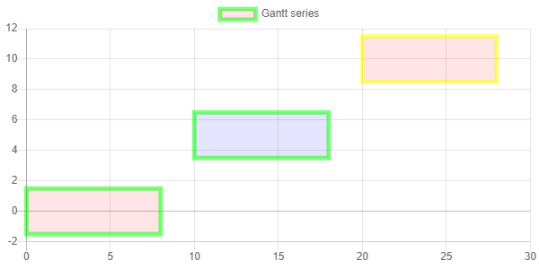

# Gantt plugin
plugin for draw gantt series in [Chart.js](https://www.chartjs.org/) library

## Sample chart



## Features

+ Setting color, border color, border width for:
  + all elements,
  + dataset,
  + some elements of dataset
+ Setting height/width elements
+ Supports time scale 

## Install

```
npm install chartjs-plugin-gantt --save
```
 
## Usage

### Basic

```javascript
const chart = new Chart("chart", {
    type: "gantt",
    data: {
        datasets: [{
            label: "Gantt series",
            data: [
                {x: {from: 0, to: 8}, y: 0},
                {x: {from: 10, to: 18}, y: 5},
                {x: {from: 20, to: 28}, y: 10},
            ]
        }]
    },
});
```


[Code Pen](https://codepen.io/anton-shchyrov/pen/VRGjxV)

### Different styles

```javascript
const chart = new Chart("chart", {
    type: "gantt",
    data: {
        datasets: [{
            label: "Default colors",
            data: [
                {x: {from: 0, to: 5}, y: 0},
                {x: {from: 6, to: 8}, y: 3},
                {x: {from: 8, to: 15}, y: 8},
            ]
        }, {
            // Set params for dataset
            borderWidth: 5,  // default options.elements.gantt.borderWidth
            borderColor: "rgba(0, 255, 0, 0.5)",  // default options.elements.gantt.borderColor
            backgroundColor: "rgba(255, 0, 0, 0.1)",  // default options.elements.gantt.backgroundColor
            label: "Override series",
            data: [
                {x: {from: 15, to: 20}, y: 0},
                {x: {from: 15, to: 20}, y: 5},
                // Set params for points
                {x: {from: 20, to: 25}, y: 1, backgroundColor: "rgba(0, 0, 255, 0.1)"},
                {x: {from: 25, to: 30}, y: 2, borderColor: "rgba(255, 255, 0, 0.5)"},
                {x: {from: 30, to: 35}, y: 3, borderWidth: 10},
            ]
        }]
    },
    options: {
        elements: {
            gantt: {
                // Set defaults params
                borderWidth: 3,  // default 1
                borderColor: "rgba(255, 0, 0, 0.1)",  // default options.defaultColor
                backgroundColor: "rgba(0, 255, 0, 0.1)",  // default options.defaultColor
            }
        }
    }
});
```


  
[Code Pen](https://codepen.io/anton-shchyrov/pen/RdYGRw)

### Different sizes

```javascript
const chart = new Chart("chart", {
    type: "gantt",
    data: {
        datasets: [{
            height: 2,  // default 5
            width: 2,  // default 5
            label: "Size sample",
            data: [
                {x: 0, y: 0},  // Rect position ((x - width / 2, y - height / 2), (x + width / 2, y + height / 2))
                {x: {from: 1, to: 5}, y: 3},  // Rect position ((x.from, y - height / 2), (x.to, y + height / 2))
                {x: 7, y: {from: 4, to: 7}},  // Rect position ((x - width / 2, y.from), (x + width / 2, y.to))
                {x: {from: 8, to: 10}, y: {from: 7, to: 12}},  // Rect position ((x.from, y.from), (x.to, y.to))
            ]
        }]
    },
});
```


[Code Pen](https://codepen.io/anton-shchyrov/pen/WmgGjO)

### Time scale

```javascript
function incHour(date, delta) {
    if (delta === undefined)
        delta = 1;
    date.setHours(date.getHours() + delta);
    return new Date(date);
}

const curDate = new Date(2019, 3, 15, 12, 0, 0);
const chart = new Chart("chart", {
    type: "gantt",
    data: {
        datasets: [{
            height: 2,  // default 5
            /*
             format for time scale:
               string "xd yh zm ps qms",
               object {d: x, h: y, m: z, s: p, ms:1} or
               number - milliseconds
             where:
               d: number of days,
               h: number of hours,
               m: number of minutes,
               s: number of seconds,
               ms: number of milliseconds.
             if the field is missing, then then is considered to be zero
             */
            width: "2h",
            label: "Time gantt",
            data: [
                {x: incHour(curDate, 0), y: 0},
                {x: {from: incHour(curDate), to: incHour(curDate, 3)}, y: 3},
            ]
        }]
    },
    options: {
        scales: {
            xAxes: [{
                type: "time-gantt",
                position: "bottom",
                time: {
                    displayFormats: {
                        millisecond: "HH:mm:ss",
                        second: "HH:mm:ss",
                        minute: "HH:mm:ss",
                        hour: "HH:mm:ss",
                        day: "HH:mm:ss",
                    },

                }
            }]
        }
    }
});
```


[Code Pen](https://codepen.io/anton-shchyrov/pen/aMamEM)

## Other

Gantt dataset supports two types of axes:
+ `linear-gantt` &mdash; the scale is inherited from the `linear` scale
+ `time-gantt` &mdash; the scale is inherited from the `time` scale
